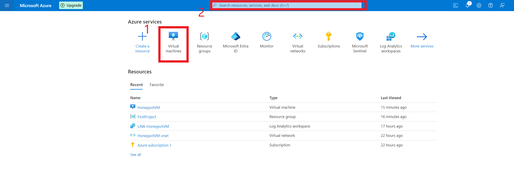
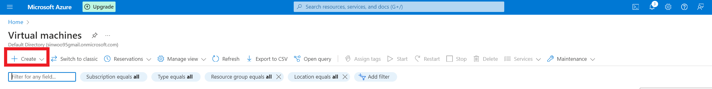
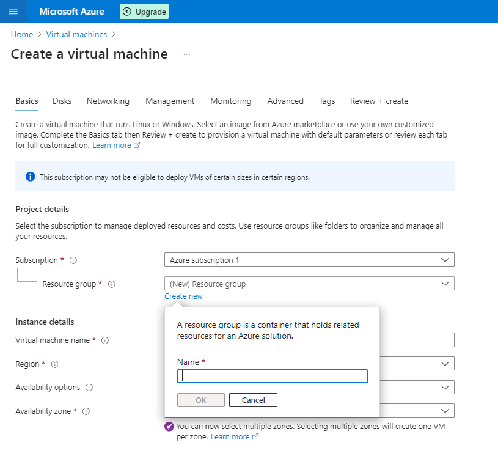
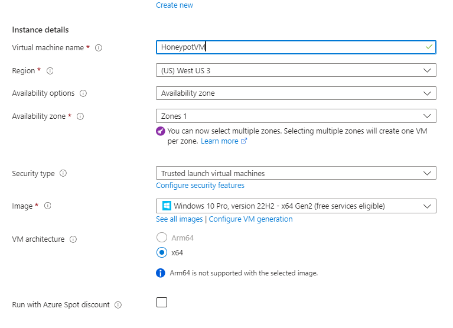
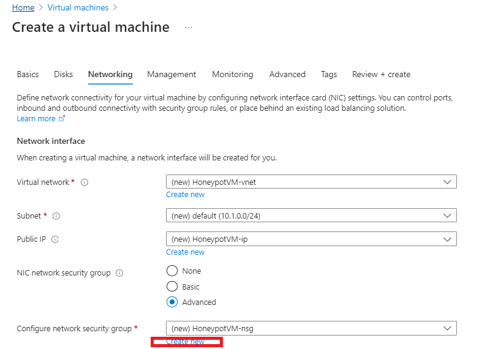
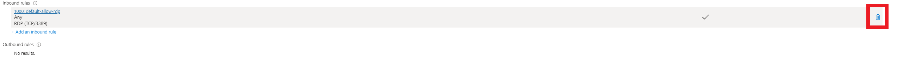
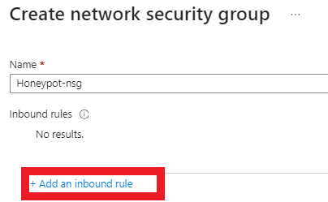
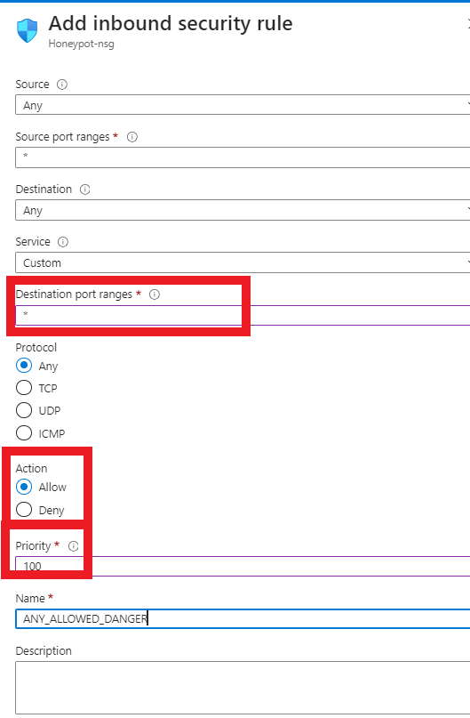

# Microsoft Sentinel SIEM Wrold Map Project

<h3>Overview</h3>
In this project, I'll illustrate the process of configuring Azure services and demonstrate their application in setting up a honeypot. By creating this environment, we can observe and analyze attacker activity as they attempt to access our virtual machine. At the end of the project, we will create a map using Microsft Sentinel to overview where the attackers were coming from as well as how many attacks were attempted. Additionally, we'll utilize Microsoft Sentinel to generate a map, providing insights into the origins of the attacks and the frequency of attempted breaches. This project was inspired by Josh Madakor's SIEM guide, and all credit goes to him.

<h4>Cloud Tools and Evnironment</h3>
AZURE VM, VNET, Log Ananlytic Workspace, Microsoft Sentinel, Windonw ver: win10-22h2-pro-g2
<h4>Languauge and Unitlites</h3>
PowerShell

<h2>Project walk-through</h2>

<h4>How to set up Azure honeypotVM</h4>
<b2>
  
  1. Click "Virtual Machine" as the screen below
  2. If you cannot find the icon, then you can search it on the search bar
</b2>

<b2>
On the next screen you will click "Create".
</b2>

<b2>
Create a new resource group by clicking "Create new".

For this instance, I will create a resource group name: FirstProject.

</b2>

<b2>
Now we are going to name our VM as HoneypotVM. Choose West US 3 for region. For the image, you will choose either Windows 10 or 11.

</b2>

<b2>
"IMPORTANT"

Username and password will be used for RDP to remotely login in to VM. If the password is too easy then attackers can possiblly brute force themselves in. Be adivsed to create password with this in mind.
Once, everything is setup. Click "Next" and get to "Networking" tab.

<b2>
We are going to name our virtual network as HoneypotVM-net. Then click on "Advance" next to Configure Network security group then "Create new".

Click the trash can icone to delete the default setting

Then click "Add an inbound rule"

</b2>

<b2>
Change "Destination port range" to * for Any
"Action" to "Allow"
Priority: 100
We'll name this "ANY_ALLOWED_DANGER", but feel free to choose any other name you prefer.
When everything is set correctly click "Add" then "Ok".
At last click "Review + Create"

