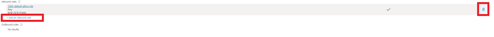

# Microsoft Sentinel SIEM World Map Project

<h3>Overview</h3>
In this project, I'll illustrate the process of configuring Azure services and demonstrate their application in setting up a honeypot. By creating this environment, we can observe and analyze attacker activity as they attempt to access our virtual machine. At the end of the project, we will create a map using Microsft Sentinel to overview where the attackers were coming from as well as how many attacks were attempted. Additionally, we'll utilize Microsoft Sentinel to generate a map, providing insights into the origins of the attacks and the frequency of attempted breaches. This project was inspired by Josh Madakor's SIEM guide, and all credit goes to him.

<h4>Cloud Tools and Evnironment</h3>
AZURE VM, VNET, Log Ananlytic Workspace, Microsoft Sentinel, Windonw ver: win10-22h2-pro-g2
<h4>Languauge and Unitlites</h3>
PowerShell

<h2>Project walk-through</h2>

<h4>Step 1: How to set up Azure honeypotVM</h4>
<b2>
  
  1. Click "Virtual Machine" as the screen below
  2. If you cannot find the icon, then you can search it on the search bar
</b2>

<b2>
On the next screen you will click "Create".
</b2>

<b2>
Create a new resource group by clicking "Create new".

For this instance, I will create a resource group name: FirstProject.

</b2>

<b2>
Now we are going to name our VM as HoneypotVM. Choose West US 3 for region. For the image, you will choose either Windows 10 or 11.

</b2>

<b2>
"IMPORTANT"

Username and password will be used for RDP to remotely login in to VM. If the password is too easy then attackers can possiblly brute force themselves in. Be adivsed to create password with this in mind.
Once, everything is setup. Click "Next" and get to "Networking" tab.

<b2>
We are going to name our virtual network as HoneypotVM-net. Then click on "Advance" next to Configure Network security group then "Create new".

Click the trash can icone to delete the default setting

Then click "Add an inbound rule"

</b2>

<b2>
Change "Destination port range" to * for Any
"Action" to "Allow"
Priority: 100
We'll name this "ANY_ALLOWED_DANGER", but feel free to choose any other name you prefer.
When everything is set correctly click "Add" then "Ok".
At last click "Review + Create"

</br2>

<h4>Step 2: How to set up Log in Azure</h4>
<br2>
Now VM is going to be created and it will take a moment.

Meanwhile we should work on creating Log.

1. Click Log Analytic Workspace
2. If you do not see the icon, you can search it on the search bar

Then click "Create"

<br2>
Resource group is going to be the same as the VM and we are going to name this log as LAW-HoneypotVM. It will have the same region as the VM as well. Then click "Review + Create"

</br2>

<h4>Step 3: How to set up Microsoft Defender for Cloud</h4>
<br2>
Again we can either search for the service or click on the icon.

Then click on "Environment settings" > Subscription name > LAW-HoneypotVM

On Defender plans page
 
Foundational CSPM - ON
 
Servers - ON
 
SQL servers on machine - OFF 
 
then click "save"

Then move to "Data collection" on the left side. Click "All Events" then click "save"

<h4>Step 4: Connecting services</h4>
<br2>
Now that we've set up all the necessary services, the next step is to establish connections between them to enable communication.
</br2>

<br2>
Let's go backto Log Analaytic Workspace then click "Virtual Machine" on the list then click on the VM that you created. Then click on "Connect".

<h4>Step 5: Microsoft Setinel (SIEM) setup</h4>
 
You can search or click on Microsofot Sentiel icon.

Then click "Create". Your Log Analytic Workspace will come up which in this case will be LAW-HoneypotVM.
Click the Log then "click Add".

<h4>Step 6: Remote into VM and VM configuration</h4>
 
Go back to "Virtual Machine" on Azure and click on the VM that you have created then you will find "Public IP address" on overview. 
 
Copy the address then login to VM via RDP on your PC. 

Then you will use the credential that you created the VM in Step 1.

"IMPORTANT"
This action has to be done on your VM not on your PC. Doing it on PC can cause serious problem.

Once you have successfully logged in.
Search for "wf.msc", then click "Windows Defender Firewall Properties".

Turn off the firewall on "Domain Profile", "Private Profile", and "Public Profile"
By turning them off VM will reponse do the ICMP echo request which will enable people to discover this VM.
We do not want to do this to our PC.

<h4>Step 7: Using PowerShell to send logs to SIEM</h4>
 
In VM search for "PowerShellISE" and start it.
Copy the code from then save it as "Log_Exporter"
 
https://github.com/joshmadakor1/Sentinel-Lab/blob/main/Custom_Security_Log_Exporter.ps1
 
Please note that you'll need your own API KEY in the script, which you can obtain by signing up at ipgeolocation.io. Then replace it with your KEY.
 
The daily limit is 1,000 queries, which resets every 24 hours.
 
You can make an account on https://ipgeolocation.io/
 
Once you've added your API KEY to the script, run the code. You'll soon notice a purple script appearing, indicating that "attackers" have discovered the VM and are attempting to log in unsuccessfully. The script will provide valuable information about the attackers.

<h4>Step 8: Create custom log</h4>
 
Go back to Azure.
 
Navigate to your Log Analytics Workspace in the Azure portal.
 
Click on "Logs" in the left sidebar.
 
Under "Tables", click on "Create" and select "New custom log (MMA-based)".
 
Retrieve the name of the log file from the VM that located C:\ProgramData\failed_rdp.log. Open Notepad on your PC, paste the name of the log file (e.g., "failed_rdp.log") and save it as type "All Files".
 
Specify the collection path as follows:
 
Type: Windows
Path: The path of the file on the VM, such as "C:\ProgramData\failed_rdp.log".
 
Custom Log Name: FAILED_RDP_WITH_GEO
 
Click on "Next" and "Review + Create" to create the custom log.
 
This setup will allow Azure Log Analytics to collect and analyze data from the specified log file on your VM.

<h4>Step 9: Running a custom log</h4>
 
Log Analytic Workspace > LAW-HoneypotVM > Log
 
Type: FAILED_RDP_WITH_GEO
 
The custom log setup in Azure collects data from "failed_rdp.log" on your VM, capturing failed login attempts sourced from the VM's Event Viewer's security log. 

<h4>Step 10: Mapping the log using SIEM</h4>
 
Microsoft Sentinel > LAW-HoneypotVM > WorkBook > Add Workbook

 
Click edit and remove 2 default settings. Then Click "Add" and "Add query".

 
Then type:
 
FAILED_RDP_WITH_GEO_CL | extend 
    username = extract(@"username:([^,]+)", 1, RawData), 
    timestamp = extract(@"timestamp:([^,]+)", 1, RawData), 
    latitude = extract(@"latitude:([^,]+)", 1, RawData), 
    longitude = extract(@"longitude:([^,]+)", 1, RawData), 
    sourcehost = extract(@"sourcehost:([^,]+)", 1, RawData), 
    state = extract(@"state:([^,]+)", 1, RawData), 
    label = extract(@"label:([^,]+)", 1, RawData), 
    destination = extract(@"destinationhost:([^,]+)", 1, RawData), 
    country = extract(@"country:([^,]+)", 1, RawData) 
| where destination != "samplehost" and sourcehost != "" and label != "" and country != "" and state != "" 
| summarize event_count=count() by timestamp, label, country, state, sourcehost, username, destination, longitude, latitude
 
 

Then change the "Visualization" to "MAP" then click "Map Settings"

 
Change the Meteric Label to "label"

 
Now you can view a visualization of attacks worldwide, depicting their frequency, source IP addresses, and estimated locations, including country details.

 
<h2>Conclusion</h4>
The project ran for a few days to gather a wider range of attacks. It was fascinating to see attacks happening globally. When we realized how many attacks were targeting just one computer, it made us think about the security challenges larger organizations face. We found out that setting up a strong firewall and NSG can help reduce risks. Using strong passwords also helps keep things safe. Adding IDS/IPS can make security even better. This project was my first time working with SIEM. It allowed me to try out different tools in Azure and write some scripts. This is my first step into the world of cybersecurity, and I'm excited to explore further and dive deeper into the cybersecurity world.

